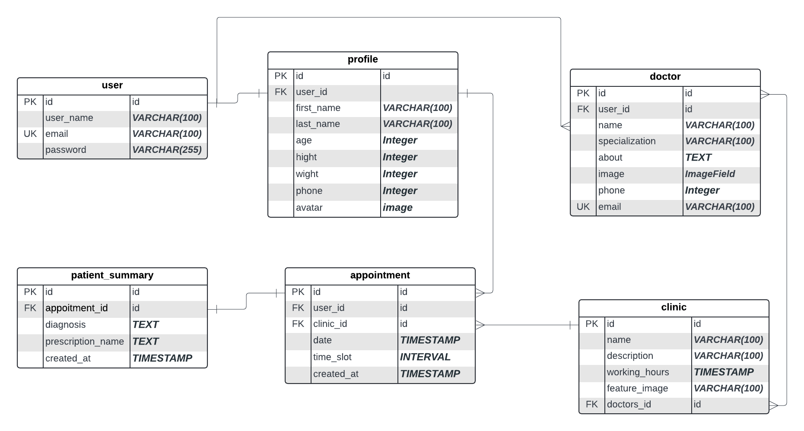

# Hospital Management System 

### Project Overview: Hospital Website

This project aim to build a web application for a hospital. The website will allow users to view clinic details, see information about doctors, make reservations, and manage their reservations.

### UML Design

### Key Features to Implement

1. **Required Pages**

   - Home page: In home page user can view informatino about the hospital , view clinics (limited with view more) , doctors (limited with view more) in the hospital, etc.
   - Clinics Page: view all clinics with pagination.
   - Doctors page: View all doctors with pagination.
   - Clinic Detail page: view clinic details, doctors working in that clinic, working hours, and the form for making a reservation for registered users.
   - Doctor Detail Page: View doctor details.
   - User Profile page: (private), where he/she can view or update his/her info.
   - User reservations page: (private) , where he/she can view or cancel reservations.

2. **Registration and Login**:

   - Use Django's built-in authentication system.
   - Extend the `User` model if necessary using a `Profile` model.

3. **Clinic Listing and Details**:

   - A page to list all clinics.
   - A detail page for each clinic showing its information and assigned doctors.

4. **Doctor Listing and Details**:

   - A page to list all doctors.
   - A detail page for each doctor showing their information and associated clinics.

5. **Reservation System**:

   - A form for authenticated users to make a reservation by choosing a clinic, doctor, and date time slot.

6. **User Dashboard**:

   - A profile page where users can view and update their information.
   - A reservations page where users can manage their bookings.

7. **Staff Dashboard**:

- implement update, add, delete for clinics, doctors. (only staff can access this page and use the features in it.)